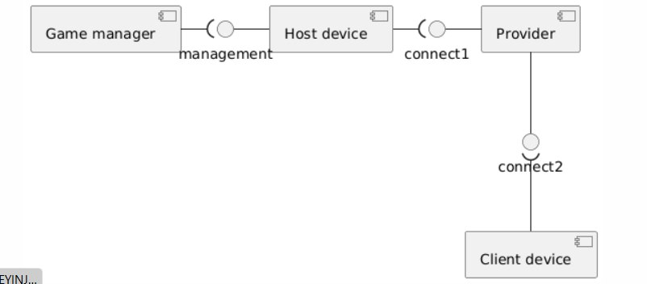
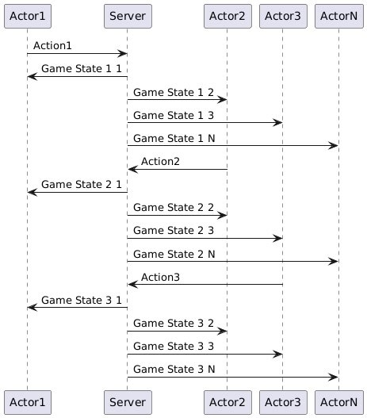
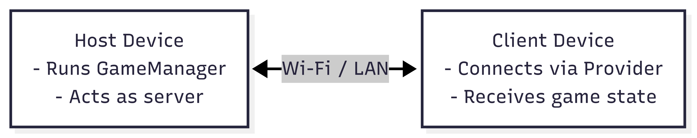

# Architecture
## Static view

- Game manager contorls the process of the game
- It works at Host device (the player who has chosen to be the host) 
- Clients (the other players that the host has invited to the game) connect to the Host using a provider
### Coupling
Вescribes how tightly components are connected or dependent on one another. Lower coupling is usually better because changes in one component have less impact on others. 

- **Game Manager ↔ Host Device**  
	- Strong but logical coupling, as the game manager only exists on the host.
- **Host Device ↔ Provider**  
	- Moderate coupling — the provider handles connections, and could potentially be replaced with another implementation.
- **Provider ↔ Client Device** 
	- Likely low coupling if connections are abstracted behind interfaces or messaging systems
 **Conclusion**: The system exhibits **moderate coupling**, which is common case for peer-to-peer architecture. 
### Cohesion
Refers to how well a component is focused on a single task or responsibility. 
- **Game Manager** - Responsible only for managing the game logic and flow — high cohesion.
- **Host Device** - Acts as the central point of control and handles player coordination — again, high cohesion.
- **Provider** - Dedicated to establishing and managing connections between devices — clearly defined responsibility.
- **Client Device** - Connects to the host and receives game state updates — well-contained functionality.
 **Conclusion**: All components demonstrate **high cohesion**, meaning each one is focused on a specific role. This improves readability, maintainability, and makes debugging or refactoring easier.
### Affect to maintainability
-  Each component has a well-defined and isolated responsibility, making the system easier to understand, modify, and extend without introducing side effects.
- While some coupling (e.g., between the Game Manager and Host Device) is expected and necessary, the system avoids unnecessary interdependencies. This makes it feasible to refactor or replace parts of the system (such as the Provider) with minimal impact on other modules.
- The modular structure ensures that bugs can be traced more easily to specific areas, and enhancements (such as switching networking backends or adding features) can be implemented incrementally.
**Conclusion**: The design encourages long-term maintainability, scalability, and clarity — all of which are critical for iterative development and future-proofing the product.
## Dynamic view

This picture shows the game loop, Actors are players, they do actions, send them at Server (Host), which update the game state and send it to Players (Clients)
### Tests
We test this scenario and server update the states and players see the changes in **0.86 seconds**, we are happy with this result
## Deployment view
The system is deployed using a peer-to-peer architecture over a local network (Wi-Fi or LAN). One of the players acts as the **Host**, running the game logic (Game Manager), while others connect as **Clients** through a shared network.

### Legend:
- Boxes: Physical devices
- Arrows: Network connections (UDP/TCP over LAN)
- Host: The player who starts the game
- Clients: Other players who join the session
### Customer-side deployment:
Players intall and start the game using [guide from readme](https://github.com/Team43CardGame/Game/blob/1546475716d29547d642d43ba82cdef56ab282c7/README.md#game-installation)
## Tech Stack
### Game development
- Unity
- Unity NetCode
- Unity Textmeshpro
### Visual Design
- Krita
- Canvas
- Figma
- Blender
